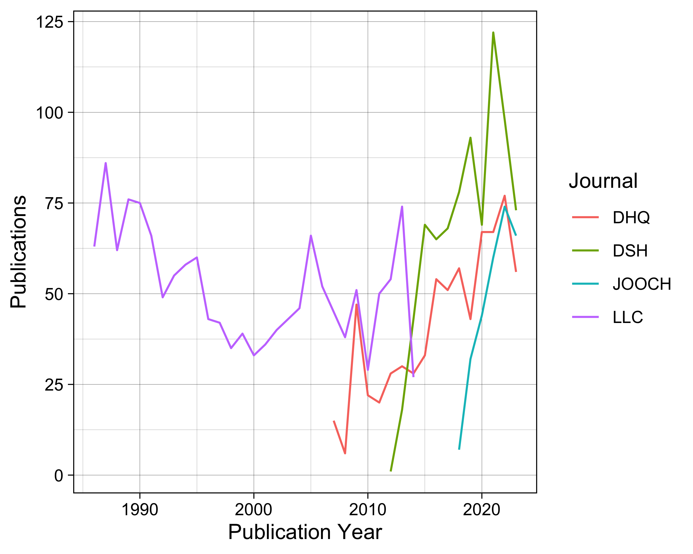

DH visualization dataset vignette
================
Kai Li
2025-03-18

## Dataset Introduction

This dataset contains three data files:

1.  **metadata.csv**: the metadata information about each publication
    extracted from the data sources, including the following columns.

<!-- -->

    **id**: The publication ID used in this dataset, such as "LLC-1." The first part of the ID refers to the journal of the publications. 
    **title**: The publication title.
    **date**: The publication year.
    **authors**: The authors of the publication. If a paper has more than one authors, the format is "[author1]; [author2]".
    **affiliations**: The affilitions of the publication. If a paper has more than one affiliations, the format is "[affiliation1]; [affiliation2]".
    **doi**: The DOI of the publication, if available.
    **journal**: The journal name of the publication.

2.  **graph.csv**: the information of each graph used in publications.
    This file includes the following columns.

<!-- -->

    **id**: The publication ID used in this dataset.
    **image_id**: The ID of each graph. 
    **image_url**: The link to the graph, if available.
    **caption**: The caption of the graph.

3.  **text.csv**: the full-text mentions of the graph. This file
    includes the following columns.

<!-- -->

    **image_id**: The ID of each graph. 
    **image_text**: The sentence in which a graph is mentioned in a publication.

## Dataset description

The dataset contains 3,260 papers in the the following four DH journals:
*Literary and Linguistic Computing* (LLC), *Digital Scholarship in the
Humanities* (DSH), *Journal on Computing and Cultural Heritage* (JOOCH),
and *Digital Humanities Quarterly* (DHQ).

    ## [1] "Unique papers in the dataset:"

    ## [1] 3260

    ## [1] "Unique papers with any graph:"

    ## [1] 1412

A summary of each journal is shown in the Table below. The results show
that the majority of papers in DSH and JOOCH have at least one graph,
contrasted to LLC. Based on our previous finding (Ma & Li, 2022), this
shows the diverse flavors of DH journals.

    ##   journal papers papers_w_graph share_papers_w_graph graphs graphs_p_paper
    ## 1     LLC   1493            119                0.080    743            6.2
    ## 2     DSH    797            596                0.748   3771            6.3
    ## 3   JOOCH    283            263                0.929   2791           10.6
    ## 4     DHQ    701            428                0.611   4233            9.9

<!-- -->
